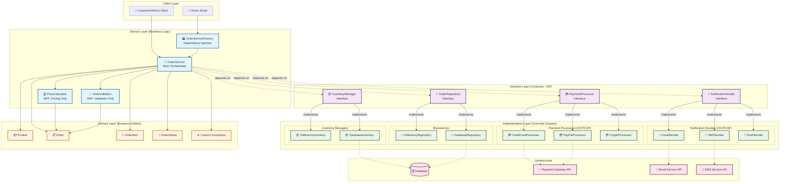

```mermaid
graph TB
    subgraph "Client Layer"
        Client[🛒 Customer/Admin Client]
        Demo[📱 Demo Script]
    end

    subgraph "Service Layer (Business Logic)"
        OrderService[🎯 OrderService<br/>Main Orchestrator]
        OrderValidator[✅ OrderValidator<br/>SRP: Validation Only]
        PriceCalculator[💰 PriceCalculator<br/>SRP: Pricing Only]
        Factory[🏭 OrderServiceFactory<br/>Dependency Injection]
    end

    subgraph "Interface Layer (Contracts - DIP)"
        PaymentInterface[💳 PaymentProcessor<br/>Interface]
        NotificationInterface[📧 NotificationSender<br/>Interface]
        InventoryInterface[📦 InventoryManager<br/>Interface]
        RepositoryInterface[💾 OrderRepository<br/>Interface]
    end

    subgraph "Implementation Layer (Concrete Classes)"
        subgraph "Payment Processors (OCP/LSP)"
            CreditCard[💳 CreditCardProcessor]
            PayPal[💳 PayPalProcessor]
            Crypto[💳 CryptoProcessor]
        end

        subgraph "Notification Senders (OCP/LSP)"
            Email[📧 EmailSender]
            SMS[📱 SMSSender]
            Push[🔔 PushSender]
        end

        subgraph "Inventory Managers"
            MemoryInventory[📦 InMemoryInventory]
            DBInventory[📦 DatabaseInventory]
        end

        subgraph "Repositories"
            MemoryRepo[💾 InMemoryRepository]
            DBRepo[💾 DatabaseRepository]
        end
    end

    subgraph "Domain Layer (Business Entities)"
        Product[📦 Product]
        Order[📋 Order]
        OrderItem[📝 OrderItem]
        OrderStatus[🔄 OrderStatus]
        Exceptions[⚠️ Custom Exceptions]
    end

    subgraph "Infrastructure"
        Database[(🗄️ Database)]
        PaymentGateway[🏦 Payment Gateway API]
        EmailService[📧 Email Service API]
        SMSService[📱 SMS Service API]
    end

    %% Client connections
    Client --> OrderService
    Demo --> Factory
    Factory --> OrderService

    %% Service layer dependencies (DIP - depends on interfaces)
    OrderService -.->|depends on| PaymentInterface
    OrderService -.->|depends on| NotificationInterface
    OrderService -.->|depends on| InventoryInterface
    OrderService -.->|depends on| RepositoryInterface
    OrderService --> OrderValidator
    OrderService --> PriceCalculator

    %% Interface implementations (LSP - substitutable)
    PaymentInterface -->|implements| CreditCard
    PaymentInterface -->|implements| PayPal
    PaymentInterface -->|implements| Crypto

    NotificationInterface -->|implements| Email
    NotificationInterface -->|implements| SMS
    NotificationInterface -->|implements| Push

    InventoryInterface -->|implements| MemoryInventory
    InventoryInterface -->|implements| DBInventory

    RepositoryInterface -->|implements| MemoryRepo
    RepositoryInterface -->|implements| DBRepo

    %% Domain model usage
    OrderService --> Product
    OrderService --> Order
    OrderService --> OrderItem
    OrderService --> OrderStatus
    OrderService --> Exceptions

    PriceCalculator --> Order
    OrderValidator --> Order

    %% External service connections
    CreditCard -.-> PaymentGateway
    PayPal -.-> PaymentGateway
    Email -.-> EmailService
    SMS -.-> SMSService
    DBInventory -.-> Database
    DBRepo -.-> Database

    %% Styling
    classDef serviceClass fill:#e1f5fe,stroke:#01579b,stroke-width:2px
    classDef interfaceClass fill:#f3e5f5,stroke:#4a148c,stroke-width:2px
    classDef implClass fill:#e8f5e8,stroke:#1b5e20,stroke-width:2px
    classDef domainClass fill:#fff3e0,stroke:#e65100,stroke-width:2px
    classDef infraClass fill:#fce4ec,stroke:#880e4f,stroke-width:2px

    class OrderService,OrderValidator,PriceCalculator,Factory serviceClass
    class PaymentInterface,NotificationInterface,InventoryInterface,RepositoryInterface interfaceClass
    class CreditCard,PayPal,Crypto,Email,SMS,Push,MemoryInventory,DBInventory,MemoryRepo,DBRepo implClass
    class Product,Order,OrderItem,OrderStatus,Exceptions domainClass
    class Database,PaymentGateway,EmailService,SMSService infraClass
```
